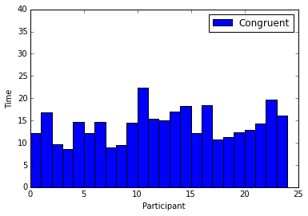
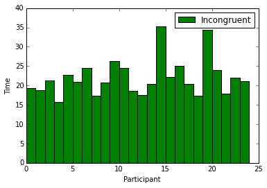

#1. What is our independent variable? What is our dependent variable?

The independent variable is the variable we have control over in this experiment. By varying the independent variable, we can measure changes in the dependent variable. In this example, the independent variable is the color/word congruence. The color and name of the color can be congruent or incongruent. The dependent variable is the variable we wish to measure in our experiment. In this example, the dependent variable is the time it takes for the participant to name the ink color.

#2. What is an appropriate set of hypotheses for this task? What kind of statistical test do you expect to perform? Justify your choices.

The two cases under study are the case where the color and word are congruent (“congruent case”) and the case where the color and word are incongruent (“incongruent case”). 

We will be comparing two population means denoted μC, μI  which correspond to the congruent and incongruent cases respectively. The null hypothesis (H0) will be that there is no difference between the two population means μC and μI. The alternative hypothesis is that the incongruent case will cause the participants to take a shorter or longer time to identify the color. This effectively means that the alternative hypothesis (H1) is that the population mean of the incongruent dataset is larger or smaller than the population mean of the congruent dataset.

<pre> <b>
H0: μC = μI  (Null Hypothesis)
H1: μC ≠ μI  (Alternative Hypothesis)
</b> </pre>

We have less than 30 samples for both the congruent and incongruent datasets and we do not know the true population mean or standard deviation. We are working with a dataset for a group of participants that have been tested twice. Therefore we will choose a two-tailed, paired sample t-test to perform the comparison and determine if we can reject the null hypothesis. We will test whether the mean of the differences between the two cases is significant.


#3. Report some descriptive statistics regarding this dataset. Include at least one measure of central tendency and at least one measure of variability.

The central tendency measures the center of a distribution of values.
Central tendency measurements: Mean, Median, Mode

The following central tendency measurements were calculated on the congruent dataset:

<b><pre>
Mean   = 14.051125
Median = 14.3565    
</pre></b>

The following central tendency measurements were calculated on the incongruent dataset:

<b><pre>
Mean   = 22.01591667
Median = 21.0175    
</pre></b>

The mode was not calculated since none of the exact values were ever repeated in each of the datasets. If we decided to create a bin size to decrease the granularity of the results, we could calculate the mode on the binned dataset.

The variability measures of the spread of a distribution of values.
Variability measurements: Range, Variance, Standard deviation from the mean.
I used Bessel’s correction in my calculations because I don’t know what the true population mean, only the mean of my sample.

The following variability measurements were calculated on the congruent dataset:

<b><pre>
Range                = 13.698     
Variance             = 12.66902907
Standard Deviation   = 3.559357958
</pre></b>

The following variability measurements were calculated on the incongruent dataset:

<b><pre>
Range                = 19.568
Variance             = 23.01175704
Standard Deviation   = 4.797057122
</pre></b>

#4. Provide one or two visualizations that show the distribution of the sample data. Write one or two sentences noting what you observe about the plot or plots.


```python
import pandas as pd
import matplotlib.pyplot as plt

# Plot within the notebook rather than in a new window
%pylab inline

# Import the data set
path = r'/Users/aehsaei/Downloads/stroopdata.csv'

# Read the csv
dataFrame = pd.read_csv(path)
```

    Populating the interactive namespace from numpy and matplotlib


```python
dataFrame
```


<div>
<table border="1" class="dataframe">
  <thead>
    <tr style="text-align: right;">
      <th></th>
      <th>Congruent</th>
      <th>Incongruent</th>
    </tr>
  </thead>
  <tbody>
    <tr>
      <th>0</th>
      <td>12.079</td>
      <td>19.278</td>
    </tr>
    <tr>
      <th>1</th>
      <td>16.791</td>
      <td>18.741</td>
    </tr>
    <tr>
      <th>2</th>
      <td>9.564</td>
      <td>21.214</td>
    </tr>
    <tr>
      <th>3</th>
      <td>8.630</td>
      <td>15.687</td>
    </tr>
    <tr>
      <th>4</th>
      <td>14.669</td>
      <td>22.803</td>
    </tr>
    <tr>
      <th>5</th>
      <td>12.238</td>
      <td>20.878</td>
    </tr>
    <tr>
      <th>6</th>
      <td>14.692</td>
      <td>24.572</td>
    </tr>
    <tr>
      <th>7</th>
      <td>8.987</td>
      <td>17.394</td>
    </tr>
    <tr>
      <th>8</th>
      <td>9.401</td>
      <td>20.762</td>
    </tr>
    <tr>
      <th>9</th>
      <td>14.480</td>
      <td>26.282</td>
    </tr>
    <tr>
      <th>10</th>
      <td>22.328</td>
      <td>24.524</td>
    </tr>
    <tr>
      <th>11</th>
      <td>15.298</td>
      <td>18.644</td>
    </tr>
    <tr>
      <th>12</th>
      <td>15.073</td>
      <td>17.510</td>
    </tr>
    <tr>
      <th>13</th>
      <td>16.929</td>
      <td>20.330</td>
    </tr>
    <tr>
      <th>14</th>
      <td>18.200</td>
      <td>35.255</td>
    </tr>
    <tr>
      <th>15</th>
      <td>12.130</td>
      <td>22.158</td>
    </tr>
    <tr>
      <th>16</th>
      <td>18.495</td>
      <td>25.139</td>
    </tr>
    <tr>
      <th>17</th>
      <td>10.639</td>
      <td>20.429</td>
    </tr>
    <tr>
      <th>18</th>
      <td>11.344</td>
      <td>17.425</td>
    </tr>
    <tr>
      <th>19</th>
      <td>12.369</td>
      <td>34.288</td>
    </tr>
    <tr>
      <th>20</th>
      <td>12.944</td>
      <td>23.894</td>
    </tr>
    <tr>
      <th>21</th>
      <td>14.233</td>
      <td>17.960</td>
    </tr>
    <tr>
      <th>22</th>
      <td>19.710</td>
      <td>22.058</td>
    </tr>
    <tr>
      <th>23</th>
      <td>16.004</td>
      <td>21.157</td>
    </tr>
  </tbody>
</table>
</div>


```python
# Assign local variables to each column dataset
congruent   = dataFrame['Congruent']
incongruent = dataFrame['Incongruent']

# Create a bar chart of
plt.xlabel("Participant")
plt.ylabel("Time")
plt.bar( range(len(dataFrame)), congruent, width=1, color='blue' )
plt.yticks( np.arange(0, 45, 5) )
plt.legend(('Congruent',''))
plt.show()

plt.xlabel("Participant")
plt.ylabel("Time")
plt.bar( range(len(dataFrame)), incongruent, width=1, color='green' )
plt.yticks( np.arange(0, 45, 5) )
plt.legend(('Incongruent',''))
plt.show()
```








The three plots above show the data for the congruent and incongruent samples. Looking at the plots, we can see that the time to indentify the color for each participant is increased for the incongruent case, over the congruent case.

#5. Now, perform the statistical test and report your results. What is your confidence level and your critical statistic value? Do you reject the null hypothesis or fail to reject it? Come to a conclusion in terms of the experiment task. Did the results match up with your expectations?

The significance level (Alpha) is 5%, and the Confidence level is 95%
<b><pre>
Confidence level = 0.95
Alpha level      = 0.05
</pre></b>

We have a sample size of 24 and therefore 23 degrees of freedom. The t-critical value for a two-tailed test with alpha=0.05:
The t-critical value for a two-tailed test with alpha=0.05:
<b><pre>
t-critical = ±2.069
</pre></b>

In order to reject the null hypothesis, the following must be true of the incongruence mean:
<br>- Our calculated t-statistic is greater than the t-critical value (2.045)


```python
#Congruent variables
Sc = 3.559357958
Xc = 14.051125

#Incongruent variables
Si = 4.797057122
Xi = 22.01591667

#Sample size of both congruent and incongruent samples
n = 24

#Calculate the samples' difference standard deviation
Diff        = congruent - incongruent
DiffMean    = Diff.mean()
DiffSquared = Diff.pow(2)
s           = sqrt((DiffSquared.sum() - pow(Diff.sum(),2)/n) /(n-1))
SError      = s/sqrt(n)

#Calculate the t-statistic
t           = (DiffMean)/SError

print t
```

    -8.02070694411


The t-statistic lies in the critical region of the distribution and therefore we can reject the null hypothesis.
This does match up with my expectations that the incongruent case caused participants to take a longer time to identify the color. 

#6. Optional: What do you think is responsible for the effects observed? Can you think of an alternative or similar task that would result in a similar effect? Some research about the problem will be helpful for thinking about these two questions!

Based on the research, the stroop effect is caused by conflicting information sent from two different areas of the brain while attempting to read an incongruent color/color_name. One area of the brain processes color and a different area processes the written name. Both results a sent to a central processing area of the brain and result in a 'race condition' of sorts for arriving at a final result.

I can think of similar task wherein the participant is faced with incongruent shapes and shape names. You could have a list of shape names written as shape-outlines. Similar to the color experiment, some shape/shape-name would be congruent and some would be incongruent.

Resources:
<pre>
http://matplotlib.org/api/pyplot_api.html
http://pandas.pydata.org/pandas-docs/stable/generated/pandas.read_csv.html
http://matplotlib.org/examples/api/barchart_demo.html
http://daringfireball.net/projects/markdown/syntax#p
https://en.wikipedia.org/wiki/Stroop_effect
http://support.minitab.com/en-us/minitab/17/topic-library/basic-statistics-and-graphs/hypothesis-tests/basics/null-and-alternative-hypotheses/
</pre>


```python

```
